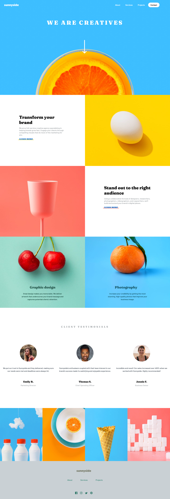
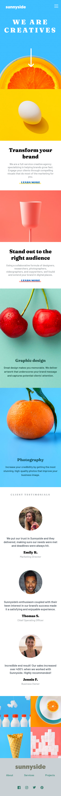

# Frontend Mentor - Sunnyside agency landing page solution

This is a solution to the [Sunnyside agency landing page challenge on Frontend Mentor](https://www.frontendmentor.io/challenges/sunnyside-agency-landing-page-7yVs3B6ef). Frontend Mentor challenges help you improve your coding skills by building realistic projects.

## Table of contents

- (#overview)
  - (#the-challenge)
  - (#screenshot)
  - (#links)
- (#my-process)
  - (#built-with)
  - (#what-i-learned)
  - (#Continued-Development)
  - (#useful-resources)
  - (#author)

**Note: Delete this note and update the table of contents based on what sections you keep.**

## Overview

### The challenge

Users should be able to:

- View the optimal layout for the site depending on their device's screen size, the design images for the challenge show the appearance as it should be at the screensize of 375px and 1440px.
- The website is also responsive for screen sizes in between 375px and 1440px. 
- The design image for the challenge shows different hover states for all interactive elements on the page. These were incorporated into the final webpage. 

### Screenshot

### Links

- Solution URL: [Add solution URL here](https://your-solution-url.com)
- Live Site URL: [Add live site URL here](https://your-live-site-url.com)

## My process

The first thing I did was review the design for Sunnyside Agency for the full screen and the mobile version. After this review I made some notes about what type of CSS properties would be needed to create a responsive webpage. This included using both flexbox and grid within the webpage. In addition, pseudo elements were needed to create the different active states for the links. 

HTML coding was completed first based on the design of the completed website. The challenge was to include both the desktop and duplicate mobile images without creating extra HTML coding. Another challenge was to include both navigation menu for desktop and mobile versions. Both these challenges requried using appropriate class and id selectors.

-- Desktop Version 

Most of the coding was for CSS. I started with styling the desktop first even though you are supposed to use a mobile first workflow. Starting from the top of the page it was clear that the navigations, logo, header and arrow had to be placed on top of the "Hero image" which was the image of a sliced orange. There was a lot of trial and error in order to get these items in the right place to match the design image. In addition, there was the issue of having it responsive. 

The next group of four frames included both images and text. This was layed out in a two column grid. Within the two frames that included text, they both have a "Learn More" link that was to have a hover effect. The hover effect was to impact the colored underline of the text. The underline was to be styled seperately using the after pseudo element so that it would match what was shown on the design. This took some time to research and to also make responsive. 

The next two images were fairly simple to layout, they just required some text to be placed on top of the images. This required some additional styles so that it would be responsive. 

The testimonial section was laid out using flex with the images styled into circles. The only challenge for this section was to use the correct fonts, color and line spacing to match closely with the design image. 

The last section before the footer was four images in a row. This was styled using flex and the images were resized to fit together in a row. 

The design image for the footer appeared to use a different background color then what was listed on the style guide. Also, the logo was shown to be a dark color although the logo image included in the file was white. Another issue with the footer was that the "active-states" design image showed that the social icons were to be white on hover. In order to both change the color of the logo and include the white hover state on the social icons, I used the Filter design element.  This required a lot of research and trial and error with the 4 different aspects of the filter element. 

-- Mobile Version

After completing the desktop version, I set up a new viewport for mobile screens with a max width of 699px. This required adding JavaScript to create a mobile navigation when clicking on the hamburger icon. In addition, the design required using mobile images that were duplicates of the desktop images but were smaller. Therefore, class id's were required to exclude the desktop version of images but include the mobile images. The rest of the styling was pretty straightforward because the design showed that everything was laid out in a single column except for the images before the footer which were set into two columns. 

The difficult part of this challenge was to have the mobile navigation appear as a quote-box; with a small triangle in the upper right corner of the navigation box. I was able to create one using the after pseudo element. However, it was not responsive to screen sizes other than 375px wide. Therefore, I did not include this in the final website. 

-- Tablet Version 

The tablet version combines items from the desktop and mobile versions. It is for screens between 700px and 1250px wide. It uses the mobile version of images however, the layout is simillar to the desktop version.   

### Built with

- Semantic HTML5 markup
- CSS custom properties
	- Flexbox
	- CSS Grid
	- CSS pseudo elements (hover and after)
- JavaScript

### What I learned

	1. This activity helped me to learn more about when to use flex and grid in designing a webpage. 
	2. I learned effective ways to use selectors to style specific items on a webpage without effecting other parts of the page. 
	3. While researching, I learned how to search effectively including finding out which sites are most helpful and which sites to avoid. 
	4. I learned the importance of responsive design and it should be used throughout your CSS code. 

### Continued development

	1. Learning more about creating efficent HTML and CSS code to not use uneccessary code.
	2. Continue developing skills needed to develop responsive sites that smoothly transition for different screen sizes. 
	3. Increase knowledge of JavaScript to include interactive elements to websites. 
	
### Useful resources

	- StackOverflow.com - This site is used as a forum for solutions to various CSS, HTML or JavaScript questions. It helped me when I had a problem with the mobile navigation that opened automatically when the page is loaded instead of through the hamburger icon.
	- css-tricks.com - I used this site to help create responsive grids. It was also good in learning about how to use the after pseudo element. 
	- w3schools.com - This is a good resource on many basic CSS or HTML topics.

## Author

- Website - Joey S. 
- Frontend Mentor - [@yourusername](https://www.frontendmentor.io/profile/yourusername)

